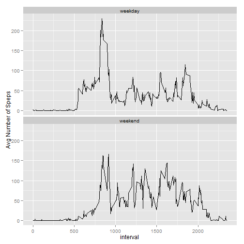

# Reproducible Research: Peer Assessment 1

Libraries

```r
library(knitr)
library(xtable)
library(plyr)
library(ggplot2)
library(scales)

options(scipen=999)
```

Set global settings for this assignment

```r
opts_chunk$set(echo= T)
Sys.setlocale("LC_TIME", "English")
```

```
## [1] "English_United States.1252"
```


## Loading and preprocessing the data  

Unzip the file

```r
if(!file.exists('Datasets'))
    dir.create('Datasets')
unzip('./activity.zip',exdir = 'Datasets')
```

Our file looks like this  

```r
file_path <- 'Datasets/activity.csv'
first_lines <- as.data.frame(readLines(file_path,n=10))
names(first_lines) <- 'file'
xt <- xtable(first_lines)
print(xt,type = 'html')
```

<!-- html table generated in R 3.1.0 by xtable 1.7-3 package -->
<!-- Mon Aug 18 10:49:30 2014 -->
<TABLE border=1>
<TR> <TH>  </TH> <TH> file </TH>  </TR>
  <TR> <TD align="right"> 1 </TD> <TD> "steps","date","interval" </TD> </TR>
  <TR> <TD align="right"> 2 </TD> <TD> NA,"2012-10-01",0 </TD> </TR>
  <TR> <TD align="right"> 3 </TD> <TD> NA,"2012-10-01",5 </TD> </TR>
  <TR> <TD align="right"> 4 </TD> <TD> NA,"2012-10-01",10 </TD> </TR>
  <TR> <TD align="right"> 5 </TD> <TD> NA,"2012-10-01",15 </TD> </TR>
  <TR> <TD align="right"> 6 </TD> <TD> NA,"2012-10-01",20 </TD> </TR>
  <TR> <TD align="right"> 7 </TD> <TD> NA,"2012-10-01",25 </TD> </TR>
  <TR> <TD align="right"> 8 </TD> <TD> NA,"2012-10-01",30 </TD> </TR>
  <TR> <TD align="right"> 9 </TD> <TD> NA,"2012-10-01",35 </TD> </TR>
  <TR> <TD align="right"> 10 </TD> <TD> NA,"2012-10-01",40 </TD> </TR>
   </TABLE>
As expected, being a .csv file, the file is  
- character separated, *comma*  
- as a header  

Looking at the file and given:  
- **steps**: Number of steps taking in a 5-minute interval (missing values are coded as NA)  
- **date**: The date on which the measurement was taken in YYYY-MM-DD format  
- **interval**: Identifier for the 5-minute interval in which measurement was taken  

Reading the data without the feature type pre-definition, we obtain the following :  

```r
dataset <- read.csv(file_path, header = T, sep = ',')
ds_classes <- sapply(dataset,class)
tmp <- data.frame(names(dataset),ds_classes)
names(tmp) <- c('Features','Type')
print(xtable(tmp),include.rownames=F , type = 'html')
```

<!-- html table generated in R 3.1.0 by xtable 1.7-3 package -->
<!-- Mon Aug 18 10:49:30 2014 -->
<TABLE border=1>
<TR> <TH> Features </TH> <TH> Type </TH>  </TR>
  <TR> <TD> steps </TD> <TD> integer </TD> </TR>
  <TR> <TD> date </TD> <TD> factor </TD> </TR>
  <TR> <TD> interval </TD> <TD> integer </TD> </TR>
   </TABLE>
Thus the *date* variable type has to be changed to a *Date* object type

```r
dataset$date <- as.POSIXct(dataset$date, format = '%Y-%m-%d')
```


## What is mean total number of steps taken per day?


```r
ds <- ddply(dataset, .(date), transform, totalstepsday = sum(steps, na.rm=T))

# using transform so I will use complete.cases() function
ds <- ds[complete.cases(ds),]
bin_width <- round(range(ds$totalstepsday) / 30)[2]

# open connection
ggplot(ds) + 
    geom_histogram(aes(x = totalstepsday),colour = "darkgreen", fill = "white", binwidth = bin_width)  +
    xlab(label = 'Steps') +
    ylab(label = 'Frequency') +
    scale_x_continuous(breaks = pretty_breaks(n=10)) +
    scale_y_continuous(breaks = pretty_breaks(n=10))
```

 

```r
mean_total_steps_per_day <- mean(ds$totalstepsday, na.rm = T)
median_total_steps_per_day <- median(ds$totalstepsday, na.rm = T)
```

The **mean** of the total number of steps taken per day is 10766.19 and the median is 10765.  

## What is the average daily activity pattern?

```r
ds_steps_per_interval <- ddply(dataset, .(interval), summarize, steps = mean(steps, na.rm=T))
ggplot(data =  ds_steps_per_interval) + 
    geom_line(aes(x=interval, y = steps )) +
    ylab('Avg Number of Speps')
```

 

```r
int_maximum_number_steps <- ds_steps_per_interval[ ds_steps_per_interval$steps == max(ds_steps_per_interval$steps), 'interval']
```

The 5-minute interval that, on average across all the days in the dataset, contains the **maximum number of steps** is 835.  

## Imputing missing values


```r
number_missing_rows <- sum(is.na(dataset$steps))
```

1. The total number of missing values in the dataset is 2304.  
2. The strategy chosen to fill the missing values was the mean for the respective 5 minute interval.


```r
dataset_no_na <- dataset
for (intv in ds_steps_per_interval$interval)
    dataset_no_na[is.na(dataset_no_na$steps) & dataset_no_na$interval == intv, 'steps'] <- ds_steps_per_interval[ds_steps_per_interval$interval == intv,'steps']
```

3. The new dataset is named *dataset_no_na*


```r
ds_no_na <- ddply(dataset_no_na, .(date), transform, totalstepsday = sum(steps, na.rm=T))
ggplot(ds_no_na) + 
    geom_histogram(aes(x = totalstepsday),colour = "darkgreen", fill = "white", binwidth = bin_width)  +
    xlab(label = 'Steps') +
    ylab(label = 'Frequency') +
    scale_x_continuous(breaks = pretty_breaks(n=10)) +
    scale_y_continuous(breaks = pretty_breaks(n=10))
```

 

```r
mean_total_steps_per_day_no_na <- mean(ds_no_na$totalstepsday, na.rm = T)
median_total_steps_per_day_no_na <- median(ds_no_na$totalstepsday, na.rm = T)
```
4. The **mean** of the total number of steps taken per day is 10766.19 and the **median** is 10766.19.  
In my case, the added values smoothed the distribution since I've used the average for each respective 5-minute interval. Thus, the mean and the median are also the same.

## Are there differences in activity patterns between weekdays and weekends?


```r
dataset_no_na$dayweek <- as.factor(ifelse(weekdays(dataset_no_na$date) %in% c('Sunday','Saturday'), 'weekend','weekday'))


ds_steps_per_interval_no_na <- ddply(dataset_no_na, .(interval,dayweek), summarize, steps = mean(steps, na.rm=T))
ggplot(data =  ds_steps_per_interval_no_na) + 
    geom_line(aes(x=interval, y = steps )) +
    ylab('Avg Number of Speps') +
    facet_wrap(.(dayweek), ncol = 1)
```

 

There are differences in the activity patterns between weekdays and weekends.  
On the **weekends** the user made, on average, less steps during the early hours of the day and more on the late hours in comparison with the **weekdays** average steps.
